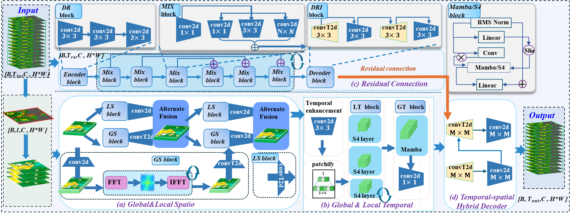

<p align="center" width="100%">
  
</p>

##  HC-SSMs: Hierarchical Convolutional State Space Models for Efficient and Accurate Spatio-Temporal Dynamical Systems Forecasting

## Abstract
 A challenging task within the deep learning community involves addressing the forecasting modeling of evolutionary dynamic systems, which encompasses issues such as limited local fidelity, poor long-term forecasting performance, low scalability, and inefficiency. This article proposes a Hierarchical Convolutional State Space Models (HC-SSMs) designed to systematically address these challenges, \textcolor{red}{a residual module}—a multi-scale convolution and deconvolution feature extraction component—that captures the integrated structural evolution of general physical processes through multi-scale convolution, thereby enhancing the macrostructural characterization of the entire system. To improve local insights and temporal evolution patterns within a single frame, a deep inverse convolution is carefully designed that integrates Fourier transforms and multi-scale local convolutions for single-frame processing. This approach enhances the interaction between local and global features within a single frame. Additionally, we introduce a multi-level variant of SSMs to uncover significant features in the underlying time series. This process leverages the flexibility of feature sizes and the elasticity of time scales within the SSM architecture, effectively addressing the challenges mentioned above. We experimentally demonstrate the performance and broad applicability of our method against prior state-of-the-art models on physical and synthetic datasets.


## Getting Started

1. Install Python 3.10.18 For convenience, execute the following command.10

```bash
pip install -r requirements.txt
```


2. Prepare Data. You can obtain experimental datasets from the following links.

| Dataset       | Task                                    | Geometry        | Link                                                         |
| ------------- | --------------------------------------- | --------------- | ------------------------------------------------------------ |
| MNIST| Predict future figure image          | future frame prediction    | https://github.com/mansimov/unsupervised-videos |
| SERIVIR| Predict future Storm EVent image          | Regular Grid    | https://opendatalab.com/OpenDataLab/SEVIR/tree/main |
| TaxiBJ| Predict future Traffic flow          | Regular Grid    | https://github.com/TolicWang/DeepST/tree/master/data/TaxiBJ |
| Pollutant-Diffusion| predict future pollutant diffusion| Regular Grid    |https://github.com/pdebench/PDEBench |
| Shallow-water equations | Predict future fluid height          | Regular Grid    | [[Google Cloud]](https://darus.uni-stuttgart.de/dataset.xhtml?persistentId=doi:10.18419/darus-2986) |


3. Use the following instructions to quickly run the code.

```python
python train_main_moving.py --data_path Dataset/mnist.npy --num_epochs 100 --batch_size 12
python train_main_moving.py --data_path Dataset/SEVIR_IR069_STORMEVENTS_bk.npy --num_epochs 100 --batch_size 12
python train_main_moving.py --data_path Dataset/BJ16_M32x32_T30_InOut.h5 --num_epochs 100 --batch_size 12

```
## Citation


## Contact


If you have any questions or want to use the code, please contact [445235990@qq.com](mailto:445235990@qq.com).

